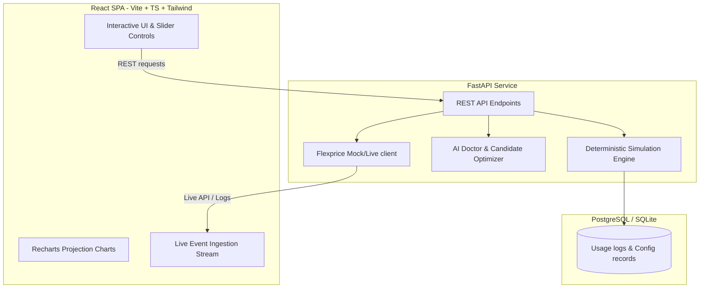

# Flexprice Revenue Twin

> **Simulate your pricing before your customers experience it.**

Flexprice Revenue Twin is a production-quality MVP for an AI-powered pricing intelligence and monetization simulation platform. It helps AI startups, product leads, and finance teams model new pricing packages (subscriptions, included quotas, and usage overages) and run deterministic simulations against historical workload events *before* deploying changes to customers.

---

## Demo Video

Check out the product walkthrough video of the Flexprice Revenue Twin platform on YouTube:
👉 **[Watch the Demo Video](https://youtu.be/wXel1RY5sGI?si=G3yGq1sIDcRx08tc)**

---

## The Problem

AI monetization is uniquely challenging:
1. **Unpredictable Cost Drivers**: LLM tokens, GPU compute seconds, vector store lookups, and third-party API tool calls mean every customer has a highly variable marginal cost profile.
2. **Bill Shock Vulnerability**: Switching subscription bases or overage fees can trigger massive bill spikes for heavy enterprise users, leading to churn.
3. **Margin Compression**: Pricing changes that look profitable on paper can lead to margin deterioration if heavy users run highly complex agents that exceed overage caps.
4. **Subjective Decision-Making**: Teams often rely on spreadsheet models or LLM calculations. LLMs are notoriously bad at math and hallucinate pricing margins, while static spreadsheets fail to reflect complex power-law usage spikes.

## The Solution

Flexprice Revenue Twin solves this with a **Monetization Decision Engine** that separates billing math from business interpretation:
- **Deterministic Billing Engine**: Aggregates raw, high-scale usage logs (tokens transacted, agent tool calls, compute time) and evaluates pricing bills with mathematical precision.
- **AI Strategic Advisor**: An LLM (Gemini or OpenAI) interprets the resulting data, warns about margin leaks, predicts account churn vectors, and reviews candidate plans.
- **Flexprice Synchronization**: Approves and deploys pricing configurations directly to Flexprice billing meters and plans.

---

## System Architecture



---

## Key Features

1. **Revenue Twin Workspace**: Interactive sliders to adjust base prices, included task units, and overage rates. Runs 100,000+ customer events in milliseconds.
2. **Executive Financial Summary**: Instant, precise updates of Total Revenue, Gross Margins, and average customer bills.
3. **Customer Impact & Bill Shock Audit**: High-density table flagging accounts experiencing more than 25% (High Risk) or 50% (Critical Risk) billing spikes, with itemized invoice breakdowns.
4. **AI Pricing Doctor**: Diagnoses pricing cliffs, margin deterioration, and structural revenue concentration.
5. **Deterministic Optimizations**: Generates 3 candidate pricing options (A, B, C) and simulates them in-memory first to obtain exact figures, using AI only to summarize tradeoffs.
6. **Flexprice Deployments & Event Stream**: Live deployment mapping to Flexprice entities (Meters, Plans, Prices, Entitlements) with an ingestion simulator tracking real-time work streams.

---

## Detailed Seeding

The default startup environment auto-seeds a simulated company called **ResearchPilot** (an AI research agent platform):
- **1,000 Customers** across Free (40%), Startup (35%), Growth (20%), and Enterprise (5%) tiers.
- **100,000+ Workload Events** transacted over a 90-day window.
- **Skewed Outlier Distributions**: Implements realistic heavy enterprise users and compute spikes to validate margin protections.

---

## Running Locally

### Option 1: Docker Compose (Recommended)

1. Clone or navigate to the repository directory.
2. Create a `.env` file in the root:
   ```env
   GEMINI_API_KEY=your_gemini_api_key
   OPENAI_API_KEY=your_openai_api_key
   ```
3. Run the container cluster:
   ```bash
   docker compose up --build
   ```
4. Access the React SPA dashboard at `http://localhost:5173`. FastAPI swagger docs are available at `http://localhost:8000/docs`.

### Option 2: Standalone Local (Without Docker)

The platform supports an automatic SQLite database fallback if PostgreSQL is not active, making local execution simple.

**Backend Startup:**
1. Navigate to the backend folder:
   ```bash
   cd backend
   ```
2. Create and activate a virtual environment:
   ```bash
   python -m venv venv
   # On Windows:
   venv\Scripts\activate
   # On macOS/Linux:
   source venv/bin/activate
   ```
3. Install Python dependencies:
   ```bash
   pip install -r requirements.txt
   ```
4. Start the FastAPI development server:
   ```bash
   uvicorn app.main:app --reload
   ```

**Frontend Startup:**
1. Navigate to the frontend folder:
   ```bash
   cd ../frontend
   ```
2. Install npm dependencies:
   ```bash
   npm install
   ```
3. Start the Vite server:
   ```bash
   npm run dev
   ```
4. Open the application at `http://localhost:5173`.

---

## Environment Variables

| Variable | Description | Default |
| :--- | :--- | :--- |
| `DATABASE_URL` | Database connection string (Postgres). Falls back to SQLite if empty. | `sqlite:///./flexprice.db` |
| `GEMINI_API_KEY` | Google Generative AI API Key for Pricing Doctor. | None |
| `OPENAI_API_KEY` | OpenAI API Key for Pricing Doctor. | None |
| `LLM_MODEL` | Preferred OpenAI Model (if using OpenAI). | `gemini-1.5-flash` |
| `FLEXPRICE_API_KEY` | Flexprice billing API Key. Enables Live Mode when present. | None |
| `FLEXPRICE_URL` | Flexprice billing server endpoint. | `https://api.flexprice.io` |

---

## Future Roadmap

- **Cohort Analysis**: Group simulations by signup cohorts to analyze pricing impact on customer retention over time.
- **Contract Replay**: Upload custom Enterprise billing SLAs and simulate historical replay on enterprise contracts.
- **Auto-optimization Loops**: Implement genetic algorithms to search pricing configuration spaces and find optimal mathematical margins automatically.
- **Churn Risk Modeling**: Correlate bill shocks with historical churn curves to predict probability of churn per customer.
- **Multi-currency & Multi-metric Billing**: Support tiered pricing for complex tokens (e.g. prompt vs completion tokens) and compute time in parallel.
